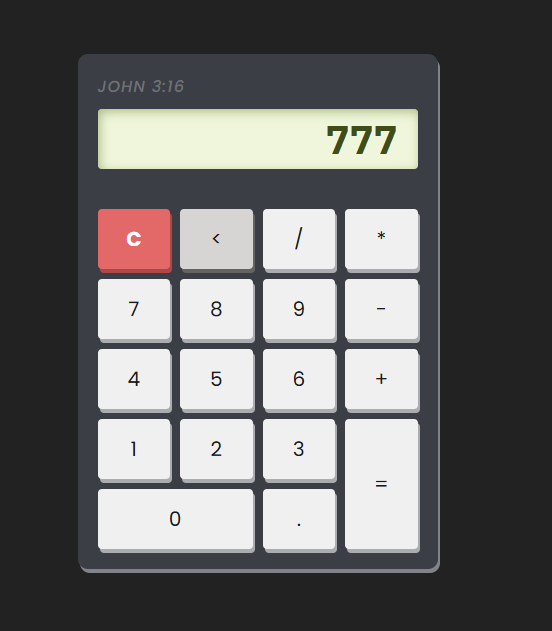

# 🧮 Calculator JS

> A simple and responsive calculator built with HTML, CSS and Vanilla JavaScript.

<br>

## 🌐 Live Preview

**[→ Open Calculator](https://gunnaroliveira.github.io/Calculator-JS/)**

<br>

## 📸 Preview

<p align="center">
  
</p>

<br>

## 📖 About

This project is a simple calculator developed to practice **JavaScript logic**, DOM manipulation and responsive interface styling.

The calculator supports basic arithmetic operations through an intuitive button-based interface.

<br>

## ✨ Features

- Addition, subtraction, multiplication and division
- Decimal numbers
- Clear display
- Backspace
- Error handling
- Responsive interface
- Simple and intuitive layout

<br>

## 🛠️ Built With

| Technology | Purpose |
|------------|---------|
| **HTML5** | Page structure and calculator controls |
| **CSS3** | Layout, styling and responsive design |
| **JavaScript** | Calculator logic and DOM manipulation |
| **Google Fonts** | IBM Plex Mono & Poppins typography |

The interface uses **IBM Plex Mono** and **Poppins** for its visual identity.

<br>

## 📁 Project Structure

```text
Calculator-JS/
├── css/
│   └── style.css
├── index.html
├── script.js
└── battery-full.png
```

<br>

## 🚀 Getting Started

Clone the repository:

```bash
git clone https://github.com/GunnarOliveira/Calculator-JS.git
```

Enter the project directory:

```bash
cd Calculator-JS
```

Then open `index.html` in your browser.

No dependencies or build tools are required.

<br>

## 🧠 What I Practiced

This project helped me practice:

- DOM manipulation
- JavaScript functions
- Event handling
- String manipulation
- Basic error handling
- Responsive CSS
- Structuring a small front-end project

The calculator logic is handled entirely with Vanilla JavaScript, including display updates, clearing, backspace and result calculation.

<br>

## 👤 Author

**Gunnar Oliveira**

- **GitHub:** [@GunnarOliveira](https://github.com/GunnarOliveira)
- **Live Preview:** [Calculator JS](https://gunnaroliveira.github.io/Calculator-JS/)

<br>

---

<p align="center">
  Made with HTML, CSS & JavaScript 💻
</p>

<p align="center">
  Jesus Loves You! ✨
</p>
